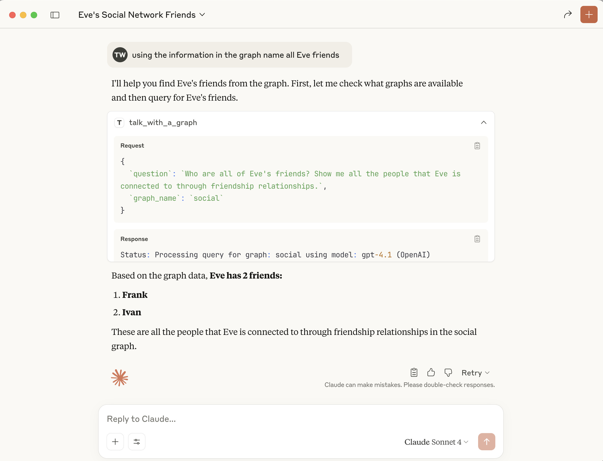

This docker contains falkordb (a very fast in memory graph database) its browser (a web interface for viewing the graph database content) and the text-to-cypher application, an app that enable you to query your graph using free text (answer are in free text as well)
All the code is open source, I will add link to the github repository at the end.

for the MCP server to work you will need to supply the .env from your local file (mounted to the docker) with the model and its key

Example .env file for text-to-cypher application
DEFAULT_MODEL=gpt-4
DEFAULT_KEY=your-api-key-here


docker run -p 6379:6379 -p 3000:3000 -p 8080:8080 -p 3001:3001 \                                git:(master|)
    -v $(pwd)/.env:/app/.env:ro falkordb/text-to-cypher
	
Once running, access the services at:
- **FalkorDB Database**: `localhost:6379` (Redis protocol)
- **FalkorDB Web Interface**: `http://localhost:3000` (Interactive graph database browser)
- **Text-to-Cypher API**: `http://localhost:8080` (REST API)
- **Swagger UI**: `http://localhost:8080/swagger-ui/` (API documentation)
- **MCP Server**: `localhost:3001` (Model Context Protocol server)
- **OpenAPI Spec**: `http://localhost:8080/api-doc/openapi.json`

loading the graph
this script load the graph using redis-cli (needed to be installed)

```shell
#!/usr/bin/env bash

GRAPH_NAME="social"

# Create nodes
redis-cli GRAPH.QUERY "$GRAPH_NAME" "CREATE
  (p1:Person {name: 'Alice'}),
  (p2:Person {name: 'Bob'}),
  (p3:Person {name: 'Carol'}),
  (p4:Person {name: 'David'}),
  (p5:Person {name: 'Eve'}),
  (p6:Person {name: 'Frank'}),
  (p7:Person {name: 'Grace'}),
  (p8:Person {name: 'Heidi'}),
  (p9:Person {name: 'Ivan'}),
  (p10:Person {name: 'Judy'})"

# Create relationships
redis-cli GRAPH.QUERY "$GRAPH_NAME" "MATCH (p1:Person {name: 'Alice'}), (p2:Person {name: 'Bob'}) CREATE (p1)-[:FRIEND]->(p2)"
redis-cli GRAPH.QUERY "$GRAPH_NAME" "MATCH (p2:Person {name: 'Bob'}), (p3:Person {name: 'Carol'}) CREATE (p2)-[:FRIEND]->(p3)"
redis-cli GRAPH.QUERY "$GRAPH_NAME" "MATCH (p3:Person {name: 'Carol'}), (p4:Person {name: 'David'}) CREATE (p3)-[:FRIEND]->(p4)"
redis-cli GRAPH.QUERY "$GRAPH_NAME" "MATCH (p4:Person {name: 'David'}), (p5:Person {name: 'Eve'}) CREATE (p4)-[:FRIEND]->(p5)"
redis-cli GRAPH.QUERY "$GRAPH_NAME" "MATCH (p5:Person {name: 'Eve'}), (p6:Person {name: 'Frank'}) CREATE (p5)-[:FRIEND]->(p6)"
redis-cli GRAPH.QUERY "$GRAPH_NAME" "MATCH (p6:Person {name: 'Frank'}), (p7:Person {name: 'Grace'}) CREATE (p6)-[:FRIEND]->(p7)"
redis-cli GRAPH.QUERY "$GRAPH_NAME" "MATCH (p7:Person {name: 'Grace'}), (p8:Person {name: 'Heidi'}) CREATE (p7)-[:FRIEND]->(p8)"
redis-cli GRAPH.QUERY "$GRAPH_NAME" "MATCH (p8:Person {name: 'Heidi'}), (p9:Person {name: 'Ivan'}) CREATE (p8)-[:FRIEND]->(p9)"
redis-cli GRAPH.QUERY "$GRAPH_NAME" "MATCH (p9:Person {name: 'Ivan'}), (p10:Person {name: 'Judy'}) CREATE (p9)-[:FRIEND]->(p10)"
redis-cli GRAPH.QUERY "$GRAPH_NAME" "MATCH (p10:Person {name: 'Judy'}), (p1:Person {name: 'Alice'}) CREATE (p10)-[:FRIEND]->(p1)"
redis-cli GRAPH.QUERY "$GRAPH_NAME" "MATCH (p1:Person {name: 'Alice'}), (p5:Person {name: 'Eve'}) CREATE (p1)-[:FRIEND]->(p5)"
redis-cli GRAPH.QUERY "$GRAPH_NAME" "MATCH (p2:Person {name: 'Bob'}), (p6:Person {name: 'Frank'}) CREATE (p2)-[:FRIEND]->(p6)"
redis-cli GRAPH.QUERY "$GRAPH_NAME" "MATCH (p3:Person {name: 'Carol'}), (p7:Person {name: 'Grace'}) CREATE (p3)-[:FRIEND]->(p7)"
```

After the graph is loaded you can browse the web endpoints using the open api at http://localhost:8080/swagger-ui/
you can edit the parameter for the methods you wish to call for example:


And execute the call directly from the open api page:


Alternativly, you can use curl, the -N instruct curl not the buffer the result so you will be able to view the SSE as they arrive from the server

```shell
curl -N --http2 -H "Accept:text/event-stream"  -X 'POST' \
  'http://localhost:8080/text_to_cypher' \
  -H 'accept: text/event-stream' \
  -H 'Content-Type: application/json' \
  -d '{
  "chat_request": {
    "messages": [
      {
        "content": "name 3 of Eve friend",
        "role": "user"
      }
    ]
  },
  "graph_name": "social"
}'
```

you will get a response like that:

```shell
data: {"Status":"Processing query for graph: social using model: gpt-4.1 (OpenAI)"}

data: {"Schema":"{\"entities\":[{\"label\":\"Person\",\"attributes\":[{\"name\":\"name\",\"type\":\"String\"}]}],\"relations\":[{\"label\":\"FRIEND\",\"source\":\"Person\",\"target\":\"Person\"}]}"}

data: {"Status":"Generating Cypher query using schema ..."}

data: {"CypherQuery":"MATCH (p:Person) WHERE toLower(p.name) = 'eve' MATCH (p)-[f:FRIEND]->(friend:Person) RETURN p, f, friend LIMIT 3"}

data: {"Status":"Executing Cypher query..."}

data: {"CypherResult":"1. [(:Person {name: \"Eve\"}), -[:FRIEND]-, (:Person {name: \"Frank\"})]\n2. [(:Person {name: \"Eve\"}), -[:FRIEND]-, (:Person {name: \"Ivan\"})]"}

data: {"Status":"Generating answer from chat history and Cypher output using AI model..."}

data: {"ModelOutputChunk":""}

data: {"ModelOutputChunk":"E"}

data: {"ModelOutputChunk":"ve"}

data: {"ModelOutputChunk":" is"}

data: {"ModelOutputChunk":" friends"}

data: {"ModelOutputChunk":" with"}

data: {"ModelOutputChunk":" Frank"}

data: {"ModelOutputChunk":" and"}

data: {"ModelOutputChunk":" Ivan"}

data: {"ModelOutputChunk":"."}

data: {"ModelOutputChunk":" There"}

data: {"ModelOutputChunk":" is"}

data: {"ModelOutputChunk":" no"}

data: {"ModelOutputChunk":" information"}

data: {"ModelOutputChunk":" given"}

data: {"ModelOutputChunk":" about"}

data: {"ModelOutputChunk":" a"}

data: {"ModelOutputChunk":" third"}

data: {"ModelOutputChunk":" friend"}

data: {"ModelOutputChunk":"."}

data: {"Result":"Eve is friends with Frank and Ivan. There is no information given about a third friend."}
```


### MCP 

For the MCP interface you can use the mcp inspector
npx -y @modelcontextprotocol/inspector

The trasnport type is SSE an the url is http://localhost:3001/sse

with that you can connect to the MCP server

you can browse the resources (graphs) and see their schema


you can list tools

you can call tools

Note that the inspector accomulate the SSE events and show them at the end.

Alternativly you can configure visual code to use this mcp server with this mcp.json file (inside the .vscode directory)

```json
{
  "servers": {
    "talk_with_a_graph": {
      "type": "sse",
      "url": "http://localhost:3001/sse"
    }
  }
}
```

you can now ask: using the information in the graph list all Eve friends
Note that you do not have to name the graph name because the model use the mcp resources to find the right graph.


Another option is to add this MCP server to claude desktop
you can do that by add the file `laude_desktop_config.json` to `/Users/$USER/Library/Application Support/Claude` with this content:

```json
{
  "mcpServers": {
    "talk_with_a_graph": {
      "command": "npx",
      "args": [
        "mcp-remote",
        "http://localhost:3001/sse"
      ]
    }
  }
}
```
Note the claude destop does not stream the SSE event to the user (it buffer the events)


