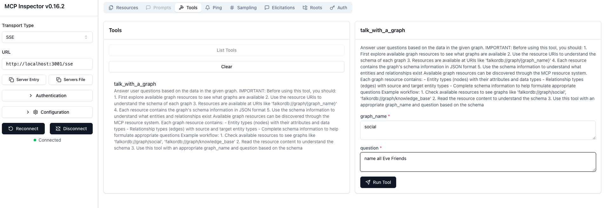

# Talk with Your Graph Database: Natural Language Queries with FalkorDB and Text-to-Cypher

This project combines FalkorDB, a blazing-fast in-memory graph database, its web-based graph browser, and a powerful **Text-to-Cypher** application that allows you to query your graph database using free-text natural language queries. The answers you receive are also in natural language, lowering the barrier to interact with complex graph data.

All code is open source, with a link to the GitHub [repository](https://github.com/FalkorDB/text-to-cypher).

## Overview

### What is FalkorDB?

FalkorDB is a high-performance graph database designed to store and query complex relationships and entities efficiently. It supports the Redis protocol, allowing easy integration with existing Redis clients, and uses the Cypher query language to manipulate graph data.

### What is Text-to-Cypher?

Text-to-Cypher is an AI-powered service that translates your natural language questions into Cypher queries automatically. Instead of writing complicated Cypher commands, you simply ask questions like "Who are Eve’s friends?" and get the answer back in plain English.

### Why Use This?

The goal is to empower users to interact with an organization's **local knowledge graph**—a structured representation of data capturing entities and their relationships—without requiring expertise in graph query languages. This can help business users, analysts, or AI assistants unlock valuable insights stored in complex graph structures by speaking the language they naturally use.

---

## How It Works

### Running the Services with Docker

You can run the entire stack easily using Docker. This includes:

- **FalkorDB Graph Database** (port 6379)
- **Graph Browser Web Interface** (port 3000)
- **Text-to-Cypher API** for natural language query translation (port 8080)
- **Model Context Protocol (MCP) Server** for AI assistant integrations (port 3001)

Example command:

```bash
docker run -p 6379:6379 -p 3000:3000 -p 8080:8080 -p 3001:3001 \ 
    -v $(pwd)/.env:/app/.env:ro falkordb/text-to-cypher
```
Your `.env` file should contain the AI model and key configurations, for example:

```shell
DEFAULT_MODEL=gpt-4
DEFAULT_KEY=your-api-key-here
```


### Loading Example Data

You can load a sample social network graph using the included bash script with `redis-cli`. This creates people nodes and friend relationships.


```shell
#!/usr/bin/env bash

GRAPH_NAME="social"

# Create nodes
redis-cli GRAPH.QUERY "$GRAPH_NAME" "CREATE
  (p1:Person {name: 'Alice'}),
  (p2:Person {name: 'Bob'}),
  (p3:Person {name: 'Carol'}),
  (p4:Person {name: 'David'}),
  (p5:Person {name: 'Eve'}),
  (p6:Person {name: 'Frank'}),
  (p7:Person {name: 'Grace'}),
  (p8:Person {name: 'Heidi'}),
  (p9:Person {name: 'Ivan'}),
  (p10:Person {name: 'Judy'})"

# Create relationships
redis-cli GRAPH.QUERY "$GRAPH_NAME" "MATCH (p1:Person {name: 'Alice'}), (p2:Person {name: 'Bob'}) CREATE (p1)-[:FRIEND]->(p2)"
redis-cli GRAPH.QUERY "$GRAPH_NAME" "MATCH (p2:Person {name: 'Bob'}), (p3:Person {name: 'Carol'}) CREATE (p2)-[:FRIEND]->(p3)"
redis-cli GRAPH.QUERY "$GRAPH_NAME" "MATCH (p3:Person {name: 'Carol'}), (p4:Person {name: 'David'}) CREATE (p3)-[:FRIEND]->(p4)"
redis-cli GRAPH.QUERY "$GRAPH_NAME" "MATCH (p4:Person {name: 'David'}), (p5:Person {name: 'Eve'}) CREATE (p4)-[:FRIEND]->(p5)"
redis-cli GRAPH.QUERY "$GRAPH_NAME" "MATCH (p5:Person {name: 'Eve'}), (p6:Person {name: 'Frank'}) CREATE (p5)-[:FRIEND]->(p6)"
redis-cli GRAPH.QUERY "$GRAPH_NAME" "MATCH (p6:Person {name: 'Frank'}), (p7:Person {name: 'Grace'}) CREATE (p6)-[:FRIEND]->(p7)"
redis-cli GRAPH.QUERY "$GRAPH_NAME" "MATCH (p7:Person {name: 'Grace'}), (p8:Person {name: 'Heidi'}) CREATE (p7)-[:FRIEND]->(p8)"
redis-cli GRAPH.QUERY "$GRAPH_NAME" "MATCH (p8:Person {name: 'Heidi'}), (p9:Person {name: 'Ivan'}) CREATE (p8)-[:FRIEND]->(p9)"
redis-cli GRAPH.QUERY "$GRAPH_NAME" "MATCH (p9:Person {name: 'Ivan'}), (p10:Person {name: 'Judy'}) CREATE (p9)-[:FRIEND]->(p10)"
redis-cli GRAPH.QUERY "$GRAPH_NAME" "MATCH (p10:Person {name: 'Judy'}), (p1:Person {name: 'Alice'}) CREATE (p10)-[:FRIEND]->(p1)"
redis-cli GRAPH.QUERY "$GRAPH_NAME" "MATCH (p1:Person {name: 'Alice'}), (p5:Person {name: 'Eve'}) CREATE (p1)-[:FRIEND]->(p5)"
redis-cli GRAPH.QUERY "$GRAPH_NAME" "MATCH (p2:Person {name: 'Bob'}), (p6:Person {name: 'Frank'}) CREATE (p2)-[:FRIEND]->(p6)"
redis-cli GRAPH.QUERY "$GRAPH_NAME" "MATCH (p3:Person {name: 'Carol'}), (p7:Person {name: 'Grace'}) CREATE (p3)-[:FRIEND]->(p7)"
```


This creates a connected network of people with friend relationships, perfect for testing queries.

### Querying the Graph

You can query the graph through several interfaces:

- **Web UI**: Use the browser at `http://localhost:3000` to visually explore and query the graph.
- **Text-to-Cypher API**: Send natural language queries via REST API at `http://localhost:8080`.
- **OpenAPI Swagger UI**: Explore and execute API calls interactively at `http://localhost:8080/swagger-ui/`.
- **MCP Server**: Integrate with AI assistants that use the Model Context Protocol on port 3001.

Example curl call to get a list of Eve’s friends:

```shell
curl -N --http2 -H "Accept:text/event-stream"  -X 'POST' \
  'http://localhost:8080/text_to_cypher' \
  -H 'accept: text/event-stream' \
  -H 'Content-Type: application/json' \
  -d '{
  "chat_request": {
    "messages": [
      {
        "content": "name 3 of Eve friend",
        "role": "user"
      }
    ]
  },
  "graph_name": "social"
}'
```


This returns a streaming response with the Cypher query, execution results, and a natural language answer.

---

## Concepts Explained

### OpenAPI

OpenAPI is a widely-adopted specification for describing RESTful APIs in a machine-readable format. This allows automatic generation of documentation, client SDKs, and interactive tools like Swagger UI. In this project, the Text-to-Cypher API fully supports OpenAPI, making it easy for developers to discover and test endpoints.


### Model Context Protocol (MCP) Server

MCP provides a standardized way for AI assistants and tools to interact with APIs and data sources. It supports:

- Listing available graph resources and their schemas
- Listing and calling tools (like `text_to_cypher`)
- Streaming responses via Server-Sent Events (SSE)

You can connect to MCP using the **MCP Inspector** tool (`npx -y @modelcontextprotocol/inspector`):





The inspector aggregates streamed events to display the complete response easily.

Using MCP you can configure text to cypher to be used from Claude destkop or vscode

## Integration with Developer Tools and AI Platforms

### Using MCP Server with Visual Studio Code

Configure VSCode to connect to the MCP server by adding a configuration file `.vscode/mcp.json`:
```json
{
  "servers": {
    "talk_with_a_graph": {
      "type": "sse",
      "url": "http://localhost:3001/sse"
    }
  }
}
```

you can now ask: using the information in the graph list all Eve friends
Note that you do not have to name the graph name because the model use the mcp resources to find the right graph.


Another option is to add this MCP server to claude desktop
you can do that by add the file `laude_desktop_config.json` to `/Users/$USER/Library/Application Support/Claude` with this content:

```json
{
  "mcpServers": {
    "talk_with_a_graph": {
      "command": "npx",
      "args": [
        "mcp-remote",
        "http://localhost:3001/sse"
      ]
    }
  }
}
```
Note the claude destop does not stream the SSE event to the user (it buffer the events)


### Server-Sent Events (SSE)

SSE is a protocol that allows servers to push real-time updates to clients over HTTP. Here, SSE is used to stream progressive query processing updates, including:

- Status messages
- Schema discovery
- Cypher query generation
- Query execution results
- Final natural language answers

This real-time feedback improves user experience, especially for longer or complex queries.

---


## Potential Use Cases

- **Enterprise Knowledge Management**: Allow employees to query corporate knowledge graphs without knowing query languages.
- **Customer Support**: AI assistants leverage organizational data to answer customer queries effectively.
- **Research Data Exploration**: Academics explore complex relationships in research datasets intuitively.
- **Intelligent Chatbots**: Integrate graph-backed insights into conversational AI for enriched responses.
- **Custom Analytics Dashboards**: Use natural language queries to build dynamic graph visualizations and reports.

---

## What Can Be Built on Top?

- **Advanced AI Assistants** that integrate multiple data sources and provide context-aware recommendations.
- **Automated Data Governance Tools** that analyze relationships and data lineage interactively.
- **Collaboration Platforms** where users query and discuss data insights leveraging the knowledge graph.
- **Domain-Specific Query Builders** which optimize natural language understanding for specialized vocabularies.

---

## Resources

- GitHub repository: [https://github.com/FalkorDB/text-to-cypher](https://github.com/FalkorDB/text-to-cypher)
- MCP Inspector: `npx -y @modelcontextprotocol/inspector`

---

Feel free to explore and contribute to this open-source ecosystem, bringing your organization's local knowledge graph interaction to the next level!


